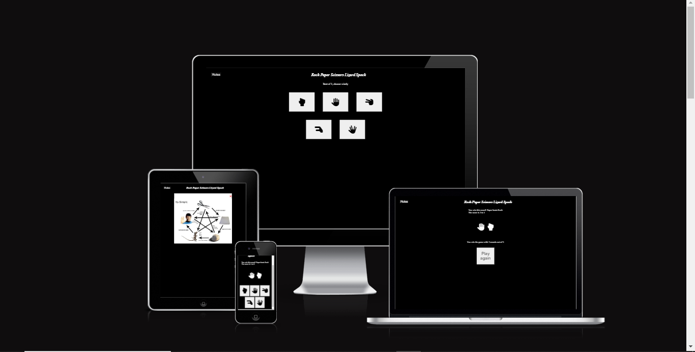

# ROCK PAPER SCISSORS LIZARD SPOCK

This website is designed to allow the user to play against the computer in a game of rock paper scissors lizard spock. Many people would be familiar with the game as it was popularised by the tv show the big bang theory, however it was created by Sam Kass in 1998.

## UX

The two main colours used are black, and white.

I used font awesome to add icons to the page.

The main header for the page uses an italic font-style.

The colour red is used

## Features

The icons visible on the page are clickable buttons that when clicked will register that icon as the users choice in the game.

The computer will generate a random number and make a choice, it will then compare your choice and the computers and determine the winner.

The site will play a minimum of three games before determining a winner.

After a game is completed the user is prompted with a play again button. 

The website is fully responsive and works on all device sizes.

There is a rules button which when clicked displays the rules of the game to the user.

## Future Features

In the future I would like to add a multiplayer option to the game which would allow users to play against other users such as their friends

## Tools & Technologies Used

- [HTML](https://en.wikipedia.org/wiki/HTML) used to display the information and images.
- [CSS](https://en.wikipedia.org/wiki/CSS) used to style the page and change the design.
- [CSS Flexbox](https://www.w3schools.com/css/css3_flexbox.asp) is used to easily control the layout of the page.
- [JavaScript](https://en.wikipedia.org/wiki/JavaScript) used to add interactivity to the page.
- [Git](https://git-scm.com) used for version control. (`git add`, `git commit`, `git push`)
- [GitHub](https://github.com) used to store the code.
- [GitHub Pages](https://pages.github.com) used for hosting the site.
- [Gitpod](https://gitpod.io) is used as a cloud-based IDE for development.
- [Visual Studio Code](https://code.visualstudio.com/) used as a source-code editor for development.

## Testing

For all testing, please refer to the [TESTING.md](TESTING.md) file.

## Deployment

The site was deployed to GitHub Pages. The steps to deploy are as follows:
- In the [GitHub repository](https://github.com/Briant-20/rock-paper-scissors-lizard-spock), navigate to the Settings tab 
- From the source section drop-down menu, select the **Main** Branch, then click "Save".
- The page will be automatically refreshed with a detailed ribbon display to indicate the successful deployment.

The live link can be found [here](https://briant-20.github.io/rock-paper-scissors-lizard-spock)

### Local Deployment

This project can be cloned or forked in order to make a local copy on your own system.

#### Cloning

You can clone the repository by following these steps:

1. Go to the [GitHub repository](https://github.com/Briant-20/rock-paper-scissors-lizard-spock) 
2. Locate the Code button above the list of files and click it 
3. Select if you prefer to clone using HTTPS, SSH, or GitHub CLI and click the copy button to copy the URL to your clipboard
4. Open Git Bash or Terminal
5. Change the current working directory to the one where you want the cloned directory
6. In your IDE Terminal, type the following command to clone my repository:
	- `git clone https://github.com/Briant-20/rock-paper-scissors-lizard-spock.git`
7. Press Enter to create your local clone.

Alternatively, if using Gitpod, you can click below to create your own workspace using this repository.

Please note that in order to directly open the project in Gitpod, you need to have the browser extension installed.
A tutorial on how to do that can be found [here](https://www.gitpod.io/docs/configure/user-settings/browser-extension).

#### Forking

By forking the GitHub Repository, we make a copy of the original repository on our GitHub account to view and/or make changes without affecting the original owner's repository.
You can fork this repository by using the following steps:

1. Log in to GitHub and locate the [GitHub Repository](https://github.com/Briant-20/rock-paper-scissors-lizard-spock)
2. At the top of the Repository (not top of page) just above the "Settings" Button on the menu, locate the "Fork" Button.
3. Once clicked, you should now have a copy of the original repository in your own GitHub account!

## Credits

I got help with the setting the rules for the game and determining the winner using the rules object from this source. [Codecademy](https://discuss.codecademy.com/t/rock-paper-scissors-lizard-spock/408911)

### Content

- [Markdown Builder](https://traveltimn.github.io/markdown-builder) - tool to help generate the Markdown files

### Acknowledgements

- I would like to thank my Code Institute mentor, [Tim Nelson](https://github.com/TravelTimN) for their support throughout the development of this project.
- I would like to thank the [Code Institute](https://codeinstitute.net) tutor team for their assistance with troubleshooting and debugging some project issues.
