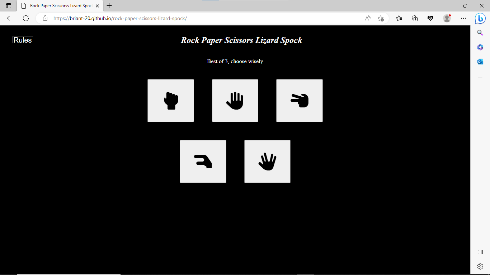

## Code Validation

### HTML

I have used the recommended [HTML W3C Validator](https://validator.w3.org) to validate all of my HTML files.

- https://validator.w3.org/nu/?doc=https%3A%2F%2FBriant-20.github.io%2Frock-paper-scissors-lizard-spock%2Findex.html

### CSS

I have used the recommended [CSS Jigsaw Validator](https://jigsaw.w3.org/css-validator) to validate all of my CSS files.

- https://jigsaw.w3.org/css-validator/validator?uri=https%3A%2F%2FBriant-20.github.io%2Frock-paper-scissors-lizard-spock

### JavaScript

I have used the recommended [JShint Validator](https://jshint.com) to validate all of my JS files.

## Browser Compatibility

| Browser | Screenshot | Notes |
| --- | --- | --- |
| Chrome |  | Works as expected |
| Firefox |  | Works as expected |
| Edge |  | Works as expected |

## User Events 

| Event | Screenshot | Notes |
| --- | --- | --- |
| Clicking the "Rules" button launches the rules modal |  | Works as expected |
| Clicking the "X" from the Rules modal closes the modal  |  | Works as expected |
| Clicking on any hand icon triggers a game round to occur, including an AI-generated competitor hand gesture |  | Works as expected |
| Clicking on a hand icon with the corresponding object that contains the computers choice in its list results in the user winning that round |  | Works as expected |
| Clicking on a hand icon which is contained in the computers corresponding object list results in the user losing that round |  | Works as expected |
| Clicking on a hand icon which corresponding object is equal to the computers results in a tie for that round and the score stays the same |  | Works as expected |
| Clicking the "Play again" button resets the game to its initial state |  | Works as expected |

## Responsiveness

| Size | Screenshot | Notes |
| --- | --- | --- |
| Mobile |  | Works as expected with slight style difference |
| Tablet (DevTools) |  | Works as expected |
| Desktop |  | Works as expected |

## Lighthouse Audit

## Bugs

### Fixed Bugs

Trying to call the `getPlayerChoice` function with a parameter inside a for-loop with an event listener.
Originally I had the function defined inside the for-loop and this worked, but when putting the code through jshint, it showed a warning because of that. When I declared the function outside of the loop, it would only return the last value for `i` and not the actual player's choice.

To fix this, I added `return function()` to the existing function so that it would create a new function every time a button was clicked, and set the new variables correctly.

After the game was finished `i` would reset to 1 this caused a TypeError with `playerChoiceIcon = gameArea.querySelectorAll("button")[i-2].innerHTML;` as it was trying to access the innerHTML of undefined.

To fix this I added an if statement to check if the value of `i` was equal to 1 before `playerChoiceIcon = gameArea.querySelectorAll("button")[i-2].innerHTML;` would run, if it is `i` will be changed to 3.

### Unfixed Bugs

When viewing the game on my iPhone SE2, the Font Awesome icons appear blue instead of white.

There are no remaining bugs that I am aware of.

