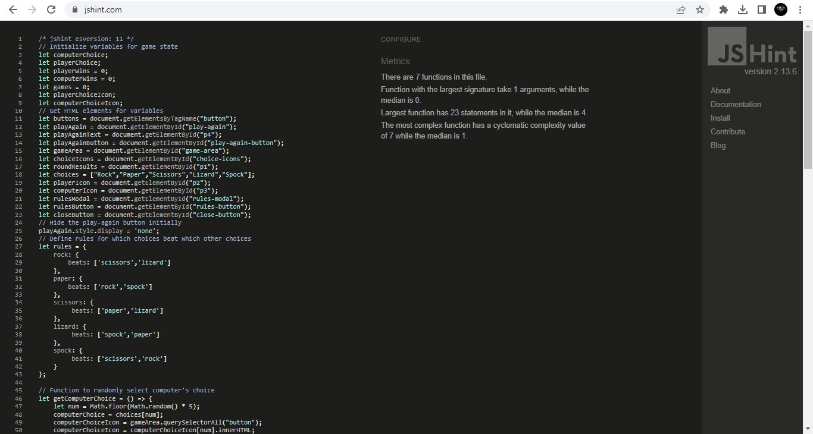
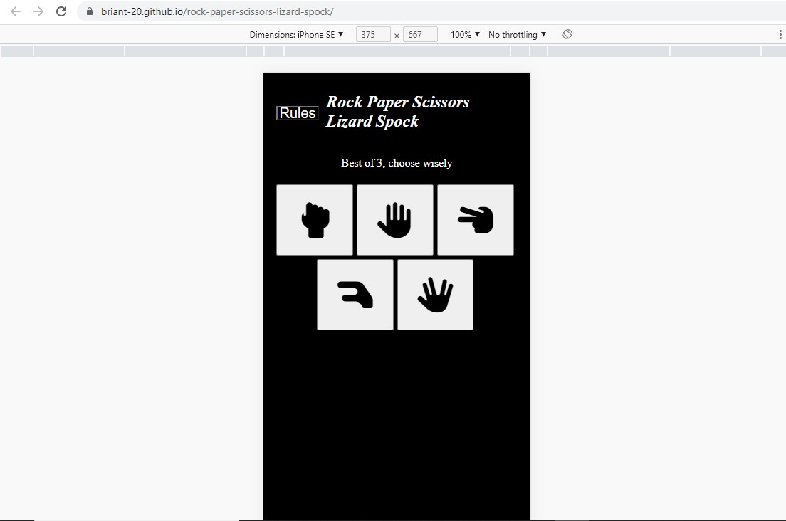

## Code Validation

### HTML

I have used the recommended [HTML W3C Validator](https://validator.w3.org) to validate all of my HTML files.

- https://validator.w3.org/nu/?doc=https%3A%2F%2FBriant-20.github.io%2Frock-paper-scissors-lizard-spock%2Findex.html

### CSS

I have used the recommended [CSS Jigsaw Validator](https://jigsaw.w3.org/css-validator) to validate all of my CSS files.

- https://jigsaw.w3.org/css-validator/validator?uri=https%3A%2F%2FBriant-20.github.io%2Frock-paper-scissors-lizard-spock

### JavaScript

I have used the recommended [JShint Validator](https://jshint.com) to validate all of my JS files.

## Browser Compatibility

| Browser | Screenshot | Notes |
| --- | --- | --- |
| Chrome |  | Works as expected |
| Firefox |  | Works as expected |
| Edge |  | Works as expected |

## Responsiveness

| Size | Screenshot | Notes |
| --- | --- | --- |
| Mobile |  | Works as expected with slight style difference |
| Tablet (DevTools) |  | Works as expected |
| Desktop |  | Works as expected |

## Lighthouse Audit

## Bugs

Trying to call the getPlayerChoice function with a parameter inside a for loop with an event listener. 

Originally i had the function defined inside the for loop and this worked but when putting the code through jshint it showed a warning because of that. When i declared the function outside the loop it would only return the last value for i and not the actual players choice. 

To fix this i added return function() to the existing function so that it would create a new function every time a button was clicked and set the new variables correctly.

There are no remaining bugs that I am aware of.

